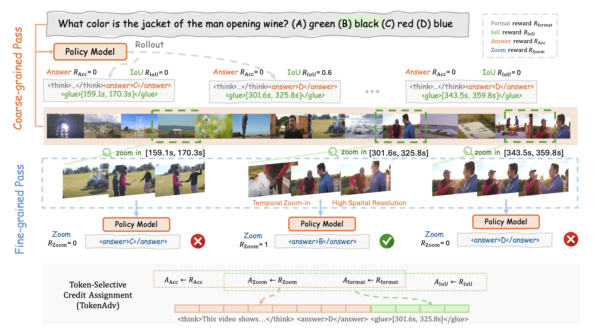

# Zoom-Zero

> **Zoom-Zero: Reinforced Coarse-to-Fine Video Understanding via Temporal Zoom-in**
>
> <a href=''></a> <a href=''></a> <a href=''></a>

## 🔍 Overview



## ⚙️ Get Started

```bash
git clone https://gitlab-master.nvidia.com/xiaoqians/zoom-zero.git
cd zoom-zero
conda create -n zoom python==3.11
conda activate zoom
pip install -r requirements.txt
```

## 🚀 Training

The list of training data is shown below.

| Dataset | Source |
|-|:-:|
| NExT-GQA| [Download](https://huggingface.co/datasets/jinyoungkim/NExT-GQA) |
| ActivityNet | [Download](https://huggingface.co/datasets/WHB139426/Grounded-VideoLLM/tree/main/activitynet) |
| QVhighlight | [Download](https://huggingface.co/datasets/WHB139426/Grounded-VideoLLM/tree/main/qvhighlights) |
| PLM-Video | [Download](https://huggingface.co/datasets/facebook/PLM-Video-Auto) |

```bash
# Training with 8 80G-A100
bash example/train_scripts/train_stage1.sh OUTPUT_DIR MODEL_PATH
bash example/train_scripts/train_stage2.sh OUTPUT_DIR MODEL_PATH
# convert model weight
python examples/train_scripts/model_merger.py --local_dir MODEL_PATH
```

## 📝 Evaluation

The list of benchmarks is shown below.

| Dataset | Task |
|-|:-:|
| [NExT-GQA](https://huggingface.co/datasets/jinyoungkim/NExT-GQA), [ReXTime](https://huggingface.co/datasets/ReXTime/ReXTime), [CG-Bench](https://huggingface.co/datasets/CG-Bench/CG-Bench) | Grounded VideoQA |  
| [Video-MME](https://huggingface.co/datasets/lmms-lab/Video-MME), [MLVU](https://huggingface.co/datasets/MLVU/MVLU), [LVBench](https://huggingface.co/datasets/zai-org/LVBench) | Long VideoQA |

Here we provide the script for running the evaluation.

```bash
# MCQ
bash examples/eval_mcq.sh MODEL_PATH # MLVU VideoMME LVBench
# GQA
bash examples/eval_gqa.sh MODEL_PATH # CGBench NextGQA ReXTime
# Zoom Coarse-to-fine
bash examples/eval_zoom.sh MODEL_PATH 0 # CGBench VideoMME LVBench MLVU
# Zoom Divide-and-conquer
bash examples/eval_zoom.sh MODEL_PATH 256 # CGBench VideoMME LVBench MLVU
```
